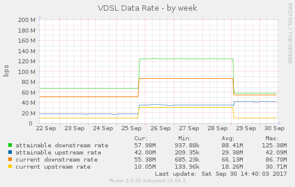
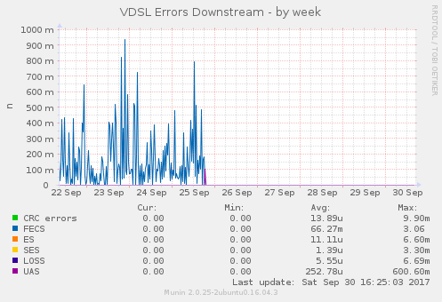
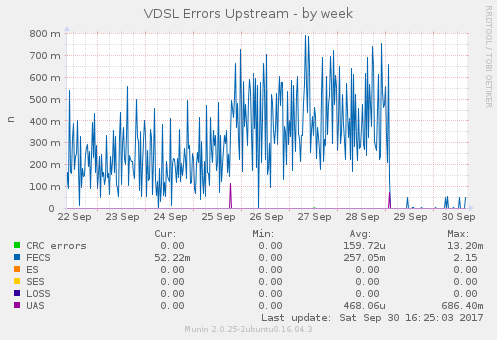
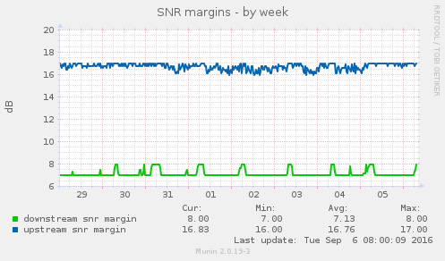

This repository contains a Munin-Plugin to read VDSL stats from a Draytek Vigor 130 VDSL-modem.
Usage information is included at the top of the script. The script grabs the DSL status page
from the modems webinterface and parses that. This was tested with
firmware version 3.7.9.1_m7. Other versions may produce different HTML output,
so parsing the data may not work there. YMMV.

License is GPL.

#### Example images

Here are some images showing what graphs it produces.

##### Telekom VDSL

This is a 50 MBit line by Deutsche Telekom, and the graphs show
some the effects of them replacing some equipment. Thanks to Bianco Veigel
for the pictures.

##### My own line at home

My line is way too good because it's just some 10 meters into the basement
(FTTB), so these look extremely dull...

