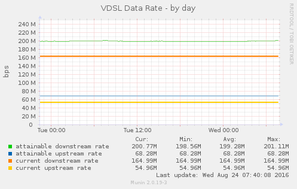
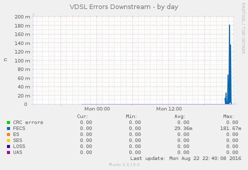

This repository contains a Munin-Plugin to read VDSL stats from a Draytek Vigor 130 VDSL-modem.
Usage information is included at the top of the script. The script grabs the DSL status page
from the modems webinterface and parses that. This was tested with
firmware version 3.7.9.1_m7. Other versions may produce different HTML output,
so parsing the data may not work there. YMMV.

License is GPL.

Here are some images showing what graphs it produces. My line is way
too good so these look extremely dull - I would gladly swap those
with images from someone who has a line that is longer than 10 meters
and actually gets disturbance from other lines...

